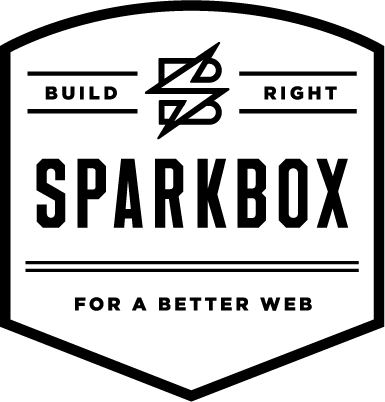

 <!-- .element: class="no-border" -->

#### Network: [NETWORKNAME]
#### Password: See White Board
#### Slides: [URL TO SLIDES](URL TO SLIDES)

While you wait for class to begin, get on the wifi, bring up the slides and go through the prerequistes for class.

---
 <!-- .element: class="no-border" -->
## Introduction to Command Line, Git & GitHub</h3>
Brought to you by [Girl Develop It Dayton](www.gdidayton.com)

[@GDIDayton](http://www.twitter.com/gdidayton)

Presented by [TEACHER NAME](TWITTER OR WEBSITE)

---
### Welcome!
Girl Develop It is here to provide affordable and accessible programs to learn software through mentorship and hands on instruction.
#### Some "rules"

* We are here for you!
* Every question is important
* Help each other
* Have fun

---
## Thanks to our location sponsor:

---
## Thanks to our snacks sponsor:

---
## A few quick announcements
* WiFi Network is [NETWORK NAME] the password is on the white board
* Restrooms are down the hall and to the right
* Please be respectful!
---					
### Introductions
* Who are you?
* What do you hope to get out of the class?
* Snow, yay or nay?
---

# Alright let's get started!
